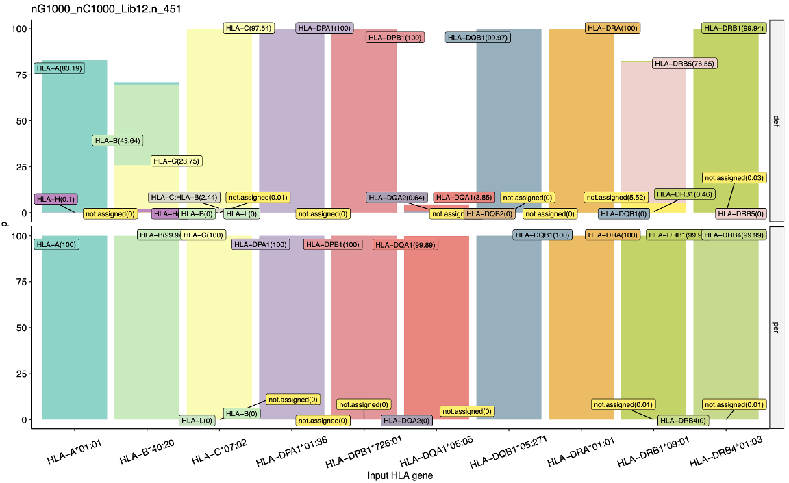

# HLApm

**HLA** **P**ersonalized **M**apping (HLApm) for quantifying HLA gene expression from single-cell and bulk RNA sequencing data using personalized reference genomes.


* [Introduction](#Introduction)
* [Requirements](#Requirements)
* [Usage for scRNA-seq data](./docs/scRNA.md)
* [Usage for bulkRNA-seq data](./docs/bulkRNA.md)
* [Contact](#contact)


   
   
# Introduction


<br>

### Simulation of mapping




def: mapping on conventional reference sequences 

per: mapping on personalized reference sequuences


# Requirements

<br>

* R4.1.0 or later

* R packages 


```R
# packages to install to build personalized reference :

install.packages( "data.table", "dplyr", "stringr")

source("https://bioconductor.org/biocLite.R")
biocLite( c("Biostrings", "rtracklayer", "DECIPHER") )

```

* bedtools 

```bash
# To install conda package  
conda install -c bioconda bedtools

# or see here, https://bedtools.readthedocs.io/en/latest/content/installation.html 
```

* Aligning reads with scRNA-seq data : cellranger-7.0.0 or later


* Primary reference and annotation: hg38 human genome 

```bash
wget https://ftp.ebi.ac.uk/pub/databases/gencode/Gencode_human/release_33/GRCh38.primary_assembly.genome.fa.gz
```
* hg38 annotation version 33 (Ensembl 99)

```bash
wget https://ftp.ebi.ac.uk/pub/databases/gencode/Gencode_human/release_33/gencode.v33.primary_assembly.annotation.gtf.gz
```


<br>
<br>


### Contact

You are welcome to:

- Submit suggestions or report bugs via our GitHub Issues page: https://github.com/davenportlab/HLApm/issues

- Reach out by email with any questions or feedback at: wl2@sanger.ac.uk


### to do..
Add HLA level 2 annotation


